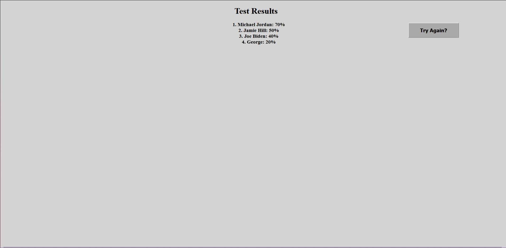

# HTML, CSS, and Javascript Coding Test
 A series of questions testing the knowledge of potential employee candidates. 

## Purpose
The purpose of this application is to test a users basic understanding of CSS, HTML, and JavaScript. After which all the questions are asked, the user enters their name and is shown their score. 

## Directions
Simply load the website and hit start to begin the test. The user will have exactly 2 minutes to answer all of the questions. If the timer reaches zero, the test will end and a prompt followed by the score will be presented to the user. As the user answers questions, they will be given 10 points for each correct answer. If the user is wrong, 5 seconds will be deducted from the timer and they will not be awarded 10 points. When all questions are answered (or the timer runs out), the user will be asked to enter their name or initials. Once entered, their score will be presented in order (from highest to lowest), along with other scores to compare. They can push the "Try again?" button to take the test over again. In which their new score will be added to the list along with their old score. 

## Link to the repo
https://github.com/xyiorgyx/HTML-CSS-and-Javascript-Test

## Live Web-link
https://xyiorgyx.github.io/HTML-CSS-and-Javascript-Test/

## Images

